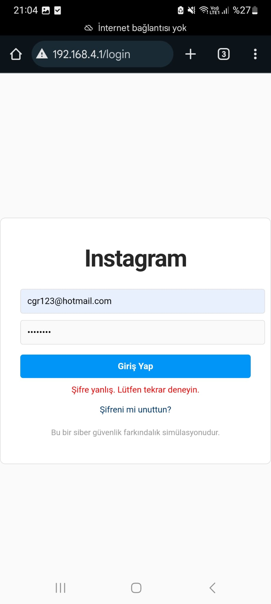
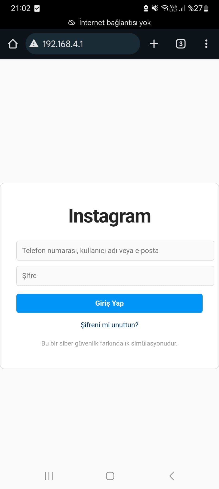
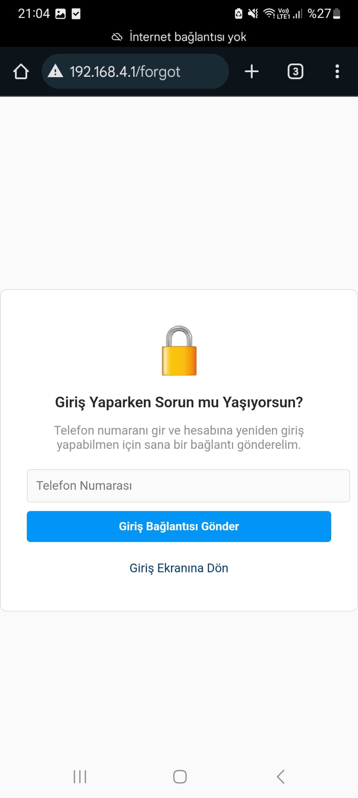
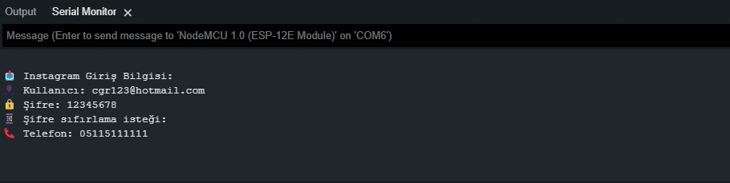

## 🧠 1. Proje Konusu
📡 **ESP8266 modülü ile sahte bir Wi-Fi ağı oluşturarak**, kullanıcıdan kimlik bilgileri toplanmasını sağlayan bir **Captive Portal (Yakalama Portalı)** sistemi geliştirilmektedir.

---

## 📝 2. Özet 
Bu projede, **ESP8266** mikrodenetleyici kartı ile **şifresiz Wi-Fi** ağı oluşturulmuş ve bağlanan kullanıcılar otomatik olarak sahte bir **Instagram giriş** sayfasına yönlendirilmiştir.  
Kullanıcı giriş yapmaya çalıştığında, **kullanıcı adı, şifre, telefon numarası terminal üzerinden kaydedilmektedir.  
Şifre ne olursa olsun sistem, **şifrenin yanlış olduğunu belirterek** kullanıcıyı "şifremi unuttum" sayfasına yönlendirmekte ve **telefon numarası** istenmektedir.

---

## 🛠️ 3. Kullanılan Yöntemler ve Araçlar

| Teknoloji / Araç         | Açıklama                                      |
|:-------------------------|:----------------------------------------------|
| 🔌 ESP8266 NodeMCU       | Wi-Fi yayını ve sunucu oluşturma             |
| 💻 Arduino IDE           | Kod geliştirme ortamı                        |
| 🌐 HTML/CSS              | Sahte portal tasarımı                        |
| 📶 Captive Portal        | Otomatik kullanıcı yönlendirmesi             |
| 🧾 Serial Monitor        | Gerçek zamanlı veri kaydı                    |
| 📋 Kullanıcı adı, şifre, telefon numarası         | Kullanıcı tanımlama verilerinin toplanması   |

---

## 🧪 4. Yapılan Çalışmalar ve Görseller

- 📶 "Free_WiFi" adlı şifresiz ağ yayınlandı.
- 📲 Cihaza bağlanan kullanıcı **otomatik olarak portala yönlendirildi**.
- 🔐 Sahte bir **Instagram giriş sayfası** tasarlandı.
- 🛑 Şifre ne olursa olsun, "şifre yanlış" uyarısı gösterildi.
- 📱 "Şifremi unuttum" ekranı ile kullanıcıdan **telefon numarası** istendi.
- 👀 Tüm veriler monitör üzerinden takip edildi.

### 📷 Görseller:

<figure>
  
  <figcaption>Genel Tasarım</figcaption>
</figure>

<figure>
  
  <figcaption>Instagram Giriş Ekranı</figcaption>
</figure>

<figure>
  
  <figcaption>Şifremi Unuttum Sayfası</figcaption>
</figure>

<figure>
  
  <figcaption>Aldığımız Bilgiler Ekranı</figcaption>
</figure>

---

## ✅ 5. Elde Edilen Sonuçlar

- 🔓 Kullanıcının girdiği **kullanıcı adı ve şifre**, monitörde doğru şekilde görüntülendi.
- 📞 **Telefon numarası alma adımı** sorunsuz şekilde çalıştı.
- 🚫 İnternet bağlantısı olmadığı için "şifreyi sıfırla" adımı hatayla sonuçlandı – bu da senaryoya uygun şekilde ilerledi.

---

## 🧱 6. Karşılaşılan Sorunlar ve Çözümler

| ⚠️ Karşılaşılan Sorun                                      | ✅ Çözüm                                               |
|:-----------------------------------------------------------|:--------------------------------------------------------|
| HTML dosyalarının ESP8266 belleğine sığmaması              | Sayfalar sadeleştirildi, inline CSS kullanıldı         |
| Mobil cihazlarda portal otomatik açılmıyordu              | HTTP başlıkları düzenlendi, zorunlu yönlendirme sağlandı |
| Bağlantı kopmaları yaşandı                                | `ESP.reset()` ile bağlantı istikrarı artırıldı         |

---

## 🔮 7. Projenin Devamında Yapılacaklar

- 💾 Giriş bilgilerini **yerel belleğe veya SD karta kaydetme**
- 💾 Bağlanan kullanıcıları **bir ekrandan takip etme**
- ☁️ Telegram botu ile **entegrasyon**
- 🧪 Farklı sosyal medya şablonlarının (Facebook, Twitter) eklenmesi
- 📱 Arayüzün mobil uyumluluğunun artırılması

---
