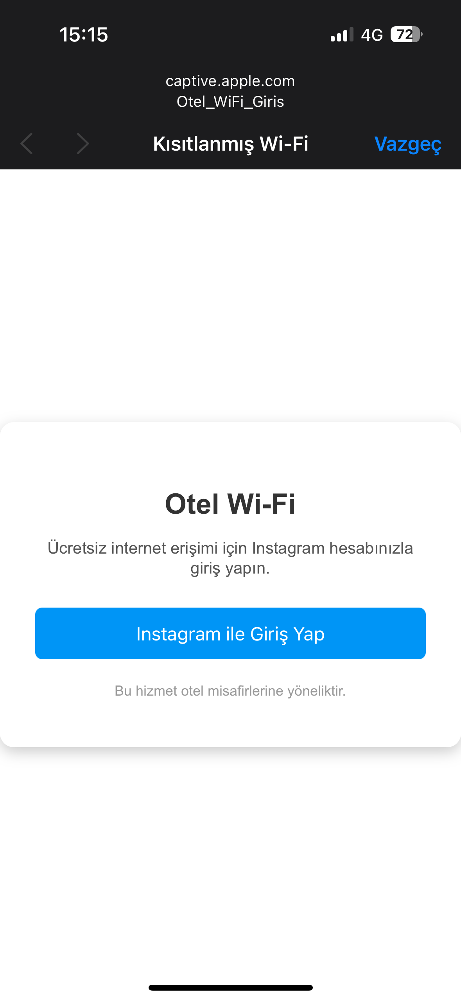
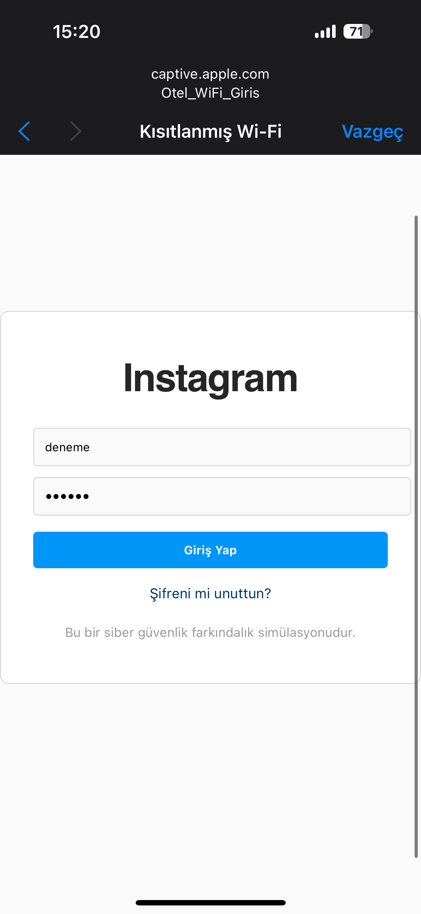
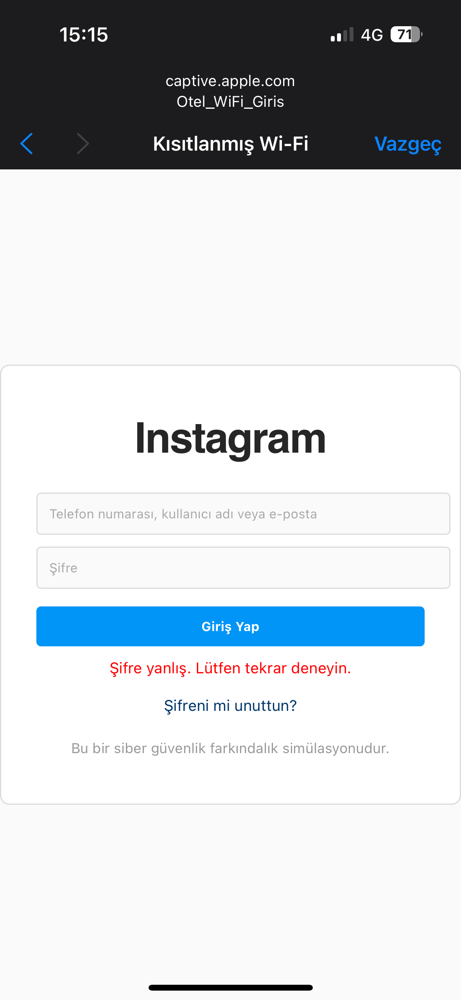
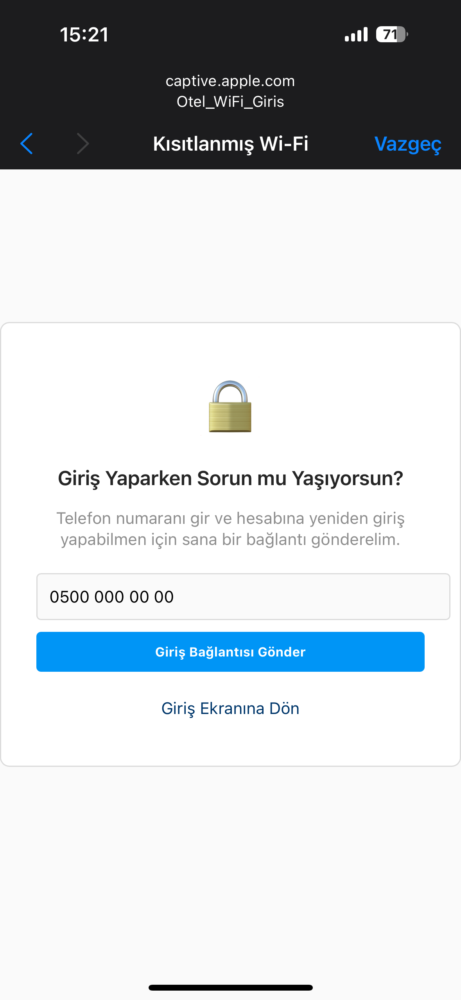
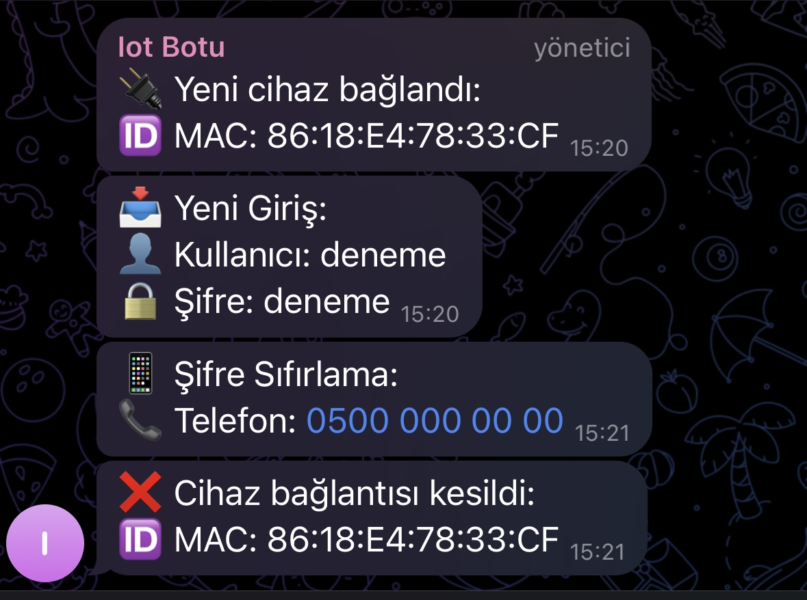

# 📄 Final Rapor

## 🧠 1. Proje Konusu

📶 **ESP8266** modülü ile sahte bir Wi-Fi ağı oluşturularak, kullanıcıdan Instagram kullanıcı adı, şifre ve telefon numarası toplanmasını sağlayan bir **Captive Portal (yakalama portalı)** sistemi geliştirilmiştir. Kullanıcı, otel temalı bir ağ üzerinden sahte bir Instagram giriş formuna yönlendirilmekte ve burada girdiği bilgiler anlık olarak **Telegram botu** aracılığıyla geliştiriciye iletilmektedir.

---

## 📝 2. Özet

Bu projede, **ESP8266** mikrodenetleyici kartı ile **şifresiz Wi-Fi** ağı oluşturulmuş ve bağlanan kullanıcılar otomatik olarak sahte bir otel portalına yönlendirilmiştir. Kullanıcı giriş yapmaya çalıştığında, **kullanıcı adı, şifre, telefon numarası** terminal üzerinden kaydedilmekte ve Telegram'a gönderilmektedir. Şifre ne olursa olsun sistem, **şifrenin yanlış olduğunu belirterek** kullanıcıyı "şifremi unuttum" sayfasına yönlendirmekte ve **telefon numarasını** da istemektedir.

---

## 🛠️ 3. Kullanılan Yöntemler ve Araçlar

| Teknoloji / Araç         | Açıklama                                       |
| ------------------------ | ---------------------------------------------- |
| 📡 ESP8266 NodeMCU       | Wi-Fi yayını ve sunucu oluşturma               |
| 💻 Arduino IDE           | Kod geliştirme ortamı                          |
| 🎨 HTML/CSS              | Sahte portal tasarımı                          |
| 🌐 Captive Portal        | Otomatik kullanıcı yönlendirmesi               |
| 📟 Serial Monitor        | Gerçek zamanlı veri kaydı                      |
| 🔐 Kullanıcı Bilgi Formu | Kullanıcı adı, şifre, telefon numarası toplama |
| 🤖 Telegram Bot          | Bilgilerin geliştiriciye anlık iletimi         |

---

## 🧪 4. Yapılan Çalışmalar ve Görseller

* 📡 **Otel\_WiFi\_Giris** adlı şifresiz ağ yayınlandı.
* 📲 Cihaza bağlanan kullanıcı **otomatik olarak portala yönlendirildi**.
* 📄 Sahte bir "Instagram giriş" arayüzü tasarlandı.
* 🔐 Kullanıcı adı ve şifre alındı, **Telegram'a gönderildi**.
* ⚠️ Yanlış şifre uyarısı ve şifremi unuttum ekranı gösterildi.
* 📩 Telegram botu tüm bilgileri ve MAC adreslerini iletti.

### 📷 Görseller

<figure>
  
  <figcaption>Genel Tasarım</figcaption>
</figure>

<figure>
  
  <figcaption>Instagram Giriş Ekranı</figcaption>
</figure>

<figure>
  
  <figcaption>Bilgileri Girince Aldığımız Hata</figcaption>
</figure>

<figure>
  
  <figcaption>Şifre Yenileme Ekranı</figcaption>
</figure>

<figure>
  
  <figcaption>Telegram Bot Mesajı</figcaption>
</figure>

---

## 🎯 5. Elde Edilen Sonuçlar

* ✅ ESP8266 ile sahte captive portal kurulumu başarıyla tamamlandı.
* ✅ HTML ve CSS ile otel temalı görsel tasarım sağlandı.
* ✅ Telegram bot entegrasyonu güvenli şekilde çalıştı.
* ✅ MAC adresi bildirimi ve kullanıcı bilgileri anlık olarak iletildi.
* ✅ İstediğimiz veriler sorunsuz şekilde alındı.

---

## 🧩 6. Karşılaşılan Sorunlar ve Çözümler

| Karşılaşılan Sorun                                  | Çözüm Yolu                                                |
| --------------------------------------------------- | --------------------------------------------------------- |
| HTML dosyalarının ESP8266 belleğine sığmaması       |Sayfalar sadeleştirildi, inline CSS kullanıldı             |
| Telegram mesajları grup içinde gitmemesi            | Bota admin yetkisi verildi ve gerekli izinler sağlandı    |
| HTTPS hatası oluşması                               | `WiFiClientSecure.setInsecure()` fonksiyonu eklendi       |
| ESP bağlantı kuramaması                             | Doğru WiFi yapılandırması ve `softAP` kullanımı sağlandı  |

---
